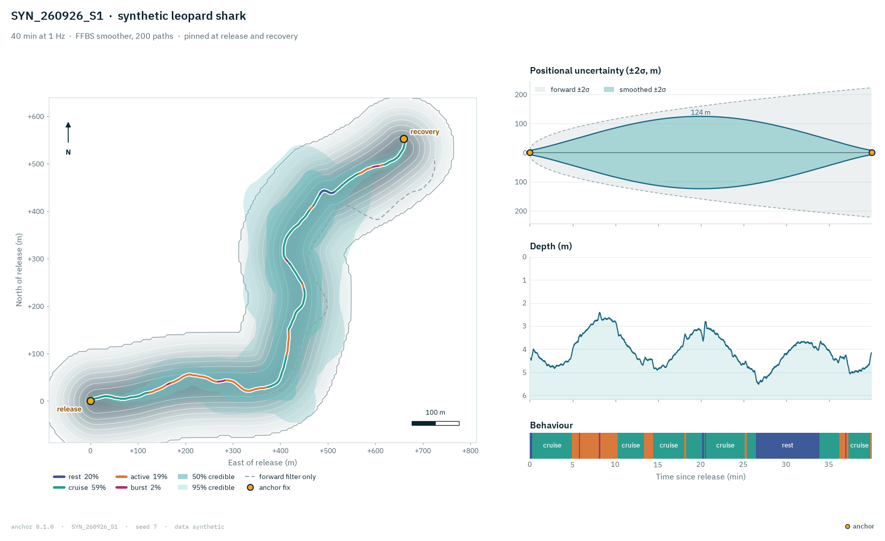

  <picture>
    <source media="(prefers-color-scheme: dark)" srcset="docs/brand/anchor-logo-dark.svg">
    
  </picture>

<strong>Know where they went, and how sure you are.</strong>

Dead-reckoned tracks and behaviour from archival accelerometer tags on white sharks,
leopard sharks and bat rays, pinned at the two places the animal is known to have been:
release and recovery. By Daniel Sambold and Dylan Moran.

> **Skeleton of an ongoing project, awaiting review.** This is the real module layout,
> signatures and docstrings, with every function body replaced by `...` and all tag data,
> site rasters and configs left out. It does not run, but the docstrings and the outline
> below are enough to rebuild the method. MIT licensed, like the full code; if it helps
> your work, please cite it (`CITATION.cff`).

## Collaborate

I am looking for collaborators. What needs work:

- **Ground truth.** Paired tag deployments and drone overflights to score reconstructed tracks against known positions.
- **Speed calibration.** The tail-beat to speed constant (K) per species needs more video with synced accelerometry.
- **Other species and sites** with archival accelerometer tags and known release and recovery points.

  
  

Each button opens a short form. Anything you would rather not post in public: <a href="https://www.linkedin.com/in/daniel-sambold-620b37221">LinkedIn</a>.

<picture>
  <source media="(prefers-color-scheme: dark)" srcset="docs/anchor-track-dark.png">
  
</picture>

A synthetic deployment: the smoothed track and its credible band between release and recovery.

## The idea

An estuarine tag has no GPS and no acoustic array, so position has to be integrated from
heading, speed and depth. Dead reckoning drifts without bound. anchor bounds it by treating
the recovery point as an observation at the end of the record and smoothing backwards, so
the track has to land where the tag was actually picked up, and the uncertainty is carried
all the way through to the space-use maps instead of being dropped after the track.

## Build your own

1. **Ingest and calibrate.** Load the tag CSV, fit a magnetometer ellipsoid (hard and soft
   iron) and gate out degenerate fits (`ingest/calibrate.py`).
2. **Kinematics.** Static and dynamic acceleration, VeDBA, pitch and roll, tail-beat
   frequency along the species' own locomotion axis (`kinematics/`).
3. **Speed and heading.** Tilt-compensated heading; speed from tail-beat frequency times
   a Strouhal-style constant K per species (`trajectory/imu.py`, `validation/` calibrates K).
4. **Particle filter.** Propagate particles from a Gaussian release prior, kill any that
   leave the tide-aware water mask or disagree with bathymetry and depth, add tidal current
   and wind leeway (`trajectory/particle_filter.py`, `polygon_constraint.py`, `tides.py`).
5. **Smooth to the end anchor.** Weight the final particles by a recovery-point likelihood
   and run a forward-filter backward-sample (FFBS) smoother to draw K joint trajectories
   (`trajectory/end_anchor.py`).
6. **Behaviour and space use.** Classify states with an HMM or a supervised model under
   subject-level cross-validation (`behavior/`), then build utilization distributions and
   VeDBA-weighted energy seascapes over all K samples (`spaceuse.py`).
7. **Score it honestly.** CRPS, variogram scores, rank histograms and containment on
   synthetic and paired-tag ground truth before any real track is quoted (`validation/ledger/`).

## Layout

| Package | What it holds | Lead |
|---|---|---|
| `anchor/ingest/` | CSV schemas, calibration, deployment configs | Dylan |
| `anchor/kinematics/` | DBA family, tail beats, mount rotation, change detection | Dylan |
| `anchor/behavior/` | HMM and supervised classifiers, video labels, CV splitters | Dylan and Daniel |
| `anchor/trajectory/` | Particle filter, FFBS, anchors, tides, wind, detachment, reports | Daniel |
| `anchor/validation/` | Pose-derived K, drone and paired-tag ground truth, the score ledger | Daniel |
| `anchor/dashboard/`, `anchor/viz/` | Local dashboard and figure theme (front end not included) | |
| `tests/` | The suite's structure and test names | |

See [`docs/architecture.md`](docs/architecture.md) for the full module map and data flow.
